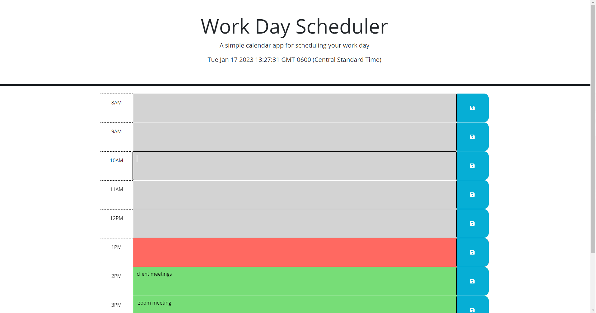

# work-day-scheduler-HW5

## Description

This assignment I created a work day scheduler, using pre-exsting HTML and CSS code. Bootstrap was used for the styling and JQuery was used for the javascript. The app is made to help people with busy schedules organize there activities/ToDo lists by the hour.

The textarea's for each hour will change color depending on the hour. Past hour textarea's will be gray, current hour textarea's will be red and future hour textarea's will be green. Text inputs to the textarea boxes are stored and will be retrieved even if the app is closed and reopened.

While working on this app I learned a lot about bootstrap and JQuery. How to properly use local storage and retrieve items.

## Installation

There is no installation process.

## Scrren-Capture

## Usage

This site will be used by users to help plan their day by the hour. Inputs in the textarea will be saved to localstorage and will be retrieved when the site is visited next. The inputs in the textarea will remain there untill the user clears it manually. As the day progresses, the current hour will be highlighted along with the future hours.

## Credits

I would like to thank the University of Minnesota's Full Stack Coding Bootcamp for providing the source code.

## Links